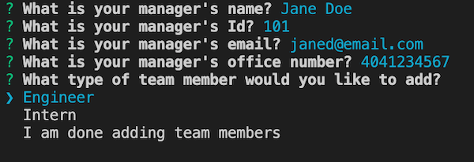

  # Team Template Engine 
  
  
  ## Description 
  This application features a Node command line interface that takes in information about each individual on a team and then generates an HTML webpage that displays information for each person. App development followed test driven development (TDD) and utilizes the Inquirer npm package, Bootstrap CSS framework, ES6 javaScript, and validated with the jest javaScript testing framework.

  Video Walkthrough  
    

  Image of Prompts   
    

  Example Output    
  See output/example-output.html in folder directory

  ## Table of Contents
  * [Installation](#installation)
  * [Usage](#usage)
  * [License](#license)
  * [Contributing](#contributing)
  * [Test Instructions](#test-instructions)
  * [Questions](#questions)

  ## Installation
    
    1. Download this project locally to your computer.   
    2. Run npm install in your bash/command line.

  ## Usage
      
    1. To run application, invoke with node app.js   
    2. Respond to the series of prompts in the terminal, your responses will be used to populate employee data in the output 'teams.html' file.
    3. View HTML in your browser. 

  ## License
  MIT (c) Hoang Nguyen   
  See LICENSE.md for details.

  ## Contributing
  Please check the app's GitHub issue tracker for known issues. Report bugs and requests to GitHub Issues.

  ## Test Instructions
  To test, invoke with npm run test. This utilizes the 'jest' framework to run through a series of test conditions. If you'd like to run the application, follow the usage instructions above. If successful, the terminal will display 'Success' when the HTML file is written.

  ## Questions
  For questions, reach out to me here:  
  Github: https://github.com/hngdngng  
  Email: [hoang.d.nguyen@outlook.com](mailto:hoang.d.nguyen@outlook.com)
  